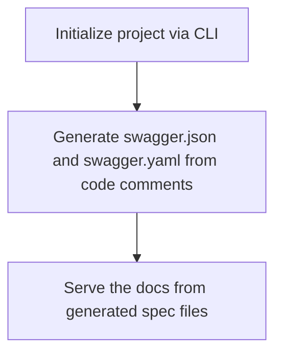

# Tonic

> See OpenAPI spec at [OpenAPI 3.0](https://spec.openapis.org/oas/latest.html)

Tonic is an OpenAPI 3.2 doc generator for Go frameworks. Unlike tools like [Swaggo](https://github.com/swaggo/swag) that rely on code comments, Tonic uses `reflection` to inspect docs straight from your routes and struct binding tags, both request and response. It currently ships adapters for Echo and Gin.

## Why's Tonic?

In the Go world, people tend to go with the Design-First approach (I am not sure why). Swaggo applies this approach, but it doesn't always work. In reality, things change. I started with a clean API spec, but once business needs shift, that spec becomes outdated fast. I got tired of updating comments every time an endpoint changed, so tedious and error-prone tasks.

Following the Code-First approach, your docs evolve with your code. So I bring Tonic to save time and keep things in sync with the actual code.

Usage flow of [swaggo](https://github.com/swaggo) combo:



Meanwhile, Tonic just reflects the code and generates the swagger documentation directly from the code itself.

## Ideas

Using `reflect`, Tonic reads struct's metadata like JSON tag, data type ... and generate an object schema for the struct. For example:

```go
type ArticleDTO struct {
    ID 		    int 	`json:"id"`
    Title 	    string	`json:"title" binding:"required,min=4,max=255"`
    Content 	string	`json:"content" binding:"required,min=20"`
}
```
Will be generated to:

```json
{
    "id": {
	    "type": "integer"
    },
    "title": {
        "type": "string",
        "minLength": 4,
        "maxLength": 255
    },
    "content": {
        "type": "string",
        "minLength": 20
    }
}
```

Combine with route definitions, Tonic constructs an object to contain API documentation data in runtime then hosts a Swagger UI for it.
